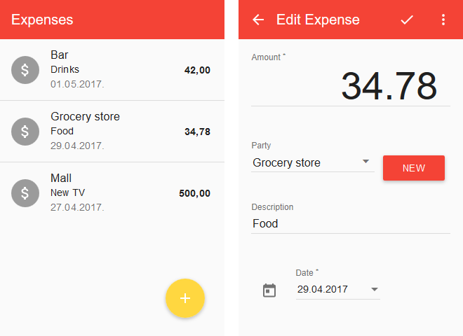

# Simple Expense Tracker

Among various applications for tracking expenses or handling personal finances I wanted something simple where you have very simple input and easy access the raw data. So I came up with this.

Simple web app with php backend intended for single user and data is stored to plain json file.

It will probably fail with on concurrent write requests because it is reading and writing one single file.

Also there is no security of any kind.

But on the plus side, it is possible to load all data into excel and do statistic there. Just import `https://<your_web>/dal.php?get` as your web data query.


## Advanced Editor for Query

```
let
    Source = Json.Document(Web.Contents("https://<your_web>/dal.php?get")),
    #"Converted to Table" = Table.FromList(Source, Splitter.SplitByNothing(), null, null, ExtraValues.Error),
    #"Renamed Columns" = Table.RenameColumns(#"Converted to Table",{{"Column1", "expense"}}),
    #"Expanded expense" = Table.ExpandRecordColumn(#"Renamed Columns", "expense", {"date", "party", "amount", "description", "id"}, {"date", "party", "amount", "description", "id"}),
    #"Changed Type" = Table.TransformColumnTypes(#"Expanded expense",{{"date", type date}, {"amount", Currency.Type}, {"id", Int64.Type}})
in
    #"Changed Type"
```


## Screenshot

This is how it looks like. There are only two forms. List and Details.

